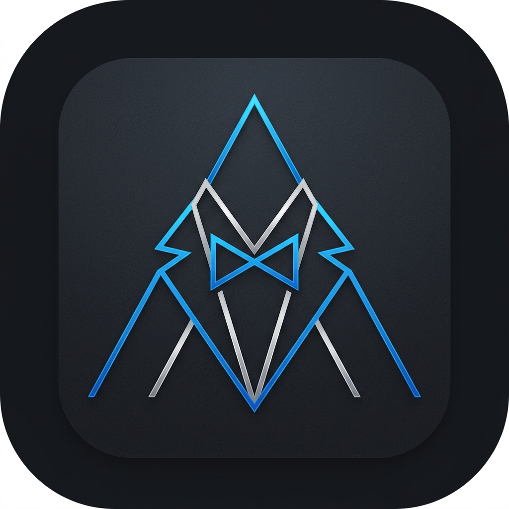

<p align="center">
  
</p>

<h1 align="center">Alfred 🎯</h1>

**Alfred** es un gestor personal de tareas (kanban + recordatorios + foco) pensado para usar uno mismo, sin equipos, sin SaaS. Dos clientes hablan con el mismo backend:

- **Web SPA instalable** (React + Vite + PWA) — la interfaz principal. Se puede instalar como app desde Chrome / Edge / Safari en escritorio y móvil; Web Push para recordatorios funciona con la pestaña cerrada.
- **CLI `alfred`** (Python + Typer) — automatización, scripting, agentes IA.

Despliegue en Docker o detrás de Tailscale. Autenticación con Google, email/contraseña, **passkeys** (WebAuthn) o Personal Access Tokens.

---

## 🌟 Características

### Organización
- **Jerarquía Usuario → Contexto → Tablero → Columna → Tarea** para separar vida personal y trabajo. Cada contexto tiene su color y su cuenta de Google asociada (opcional).
- **Tableros** con icono emoji personalizable, drag-and-drop de columnas, ancho de columna dinámico (1 lista → 2× ancho; muchas listas → scroll horizontal con `minWidth: 0` a través del árbol de flex).
- **Columnas** renombrables in-place, reordenables por drag-and-drop.
- **Tareas** con título, descripción Markdown (GFM), prioridad (tinta de fondo por nivel), fecha límite, tags, requester ("Encargada por"), assignees ("Asignado a"), subtareas anidadas, recordatorios y adjuntos.
- **Subtareas** como tareas de pleno derecho con `parent_task_id`. Para anidar tareas existentes: Shift+drag sobre otra tarjeta, o la fila "Subtarea de" en el modal.
- **Mover tareas entre tableros** del mismo contexto desde el detalle.
- **Archivado** por tarea o batch por columna; vista de archivadas accesible desde el menú "⋯".
- **Búsqueda / filtros** por texto (título, descripción, requester, assignees), tags, fechas y personas. Chips activos visibles bajo la barra.

### Contactos
- Sincronización con Google People por cuenta conectada (scope `contacts.readonly`). Los contactos quedan scoped al `google_account_id` para que un mismo email pueda existir en cuentas Personal y Trabajo.
- Contacto "Yo mismo" auto-creado por usuario, con foto del primer Google account, no eliminable, assignee por defecto.
- Resync idempotente: deduplica por `google_contact_id` y reclama huérfanos.
- **Buscador y filtro de favoritos** en la pantalla de gestión (útil con >400 contactos).
- **Selector con búsqueda** (dropdown + dialog) al asignar contactos a tareas — favoritos al tope, búsqueda por nombre / email.

### Recordatorios y notificaciones
- **Web Push** con VAPID + Service Worker. Las claves VAPID se persisten como **base64url DER PKCS8** (formato a prueba de cambios de py_vapid) en `data/vapid_keys.json` y se autogeneran si no existen.
- El dispatcher es robusto: una suscripción muerta no impide la entrega al resto. Mantiene también un canal opcional FCM (legado del cliente Android nativo, ahora descartado — el código sigue en el backend por si vuelve un cliente móvil).
- Recordatorios con presets ("dentro de X minutos", "mañana 09:00") o picker custom. Funcionan cross-device: lo creas en cualquier cliente, llega a todos los demás.

### Adjuntos
- Web: drag-and-drop, paste desde portapapeles, click-to-pick. Imágenes con thumbnail + lightbox; documentos con badge 📎.
- Móvil: file picker del sistema desde el detalle de tarea.
- Almacenamiento local en `data/attachments/<uuid>.<ext>`. Cap 15 MB por archivo.

### Foco / Estadísticas
- Pomodoro (15/25/50 min) vinculado a tarea concreta. Floating overlay minimizable.
- Estadísticas: tiempo total + sesiones completadas + gráfica de barras diarias. Agregadas server-side, **consistentes entre dispositivos**.

### Autenticación
- **Email + contraseña local** (bcrypt + JWT).
- **OAuth2 con Google** (sign-in + connect-additional-account).
- **Passkeys / WebAuthn** (discoverable credentials — sin email; el navegador ofrece directamente las passkeys registradas).
- **Personal Access Tokens** (`alfred_pat_*`) para clientes headless (CLI, automations, agentes IA).
- **Auto-redirect a login al caducar sesión**: cualquier 401 mid-session en endpoints autenticados limpia el token y vuelve al formulario, sin pantallas zombies ni hard refresh.

### Instalable como PWA
- Manifest + Service Worker hacen que el SPA se instale como app desde la barra de direcciones de Chrome / Edge (escritorio o móvil) y "Add to Home Screen" en Safari.
- Web Push entrega recordatorios incluso con la pestaña cerrada.

### Productividad
- **Quick Capture** con `Alt + Q` para crear una tarea desde cualquier pantalla.
- **Auto-save** del modal de tarea (sin botón "Guardar"); `Ctrl/Cmd + Enter` confirma y cierra.
- **Esc** cierra cualquier diálogo.
- **Back del navegador integrado**: la flecha atrás / gesto edge-swipe en Chrome mueven entre contextos y tableros previos en lugar de salir del SPA.
- Avatar + nombre real del usuario en la sidebar, tomados del primer Google account conectado (fallback al email).

---

## 🛠️ Stack

### Backend
- **Python 3.12**, **FastAPI**, **Pydantic v2** (`UtcDatetime` annotated type → siempre serializa con sufijo `Z`).
- **SQLAlchemy 2** async con **aiosqlite**. Migraciones idempotentes en lifespan (PRAGMA + ALTER TABLE + table rebuild cuando hace falta quitar constraints anónimos).
- **PyJWT** + **bcrypt** para JWT y password hashing.
- **pywebpush** + VAPID para notificaciones del navegador.
- **firebase-admin** para FCM (push al móvil).
- **webauthn** (`>=2.5`) para passkeys.
- **google-auth** + verificación remota de ID tokens.
- **uv** para gestión de deps y empaquetado.

### Frontend
- **React 19**, **Vite 8**, **TypeScript** estricto.
- **CSS vanilla** (variables HSL + glassmorphism).
- **react-markdown** + **remark-gfm** para descripciones.
- **Service Worker** en `frontend/public/sw.js` (Web Push + clic en notificación + fetch passthrough para installability).
- **PWA**: `frontend/public/manifest.webmanifest` + iconos 192/512px.
- **WebAuthn helpers** propios en `src/services/webauthn.ts` (base64url ↔ ArrayBuffer + flujos).

### CLI
- **Python 3.11+**, **uv**, **Typer**, **httpx**, **questionary** (pickers), **tomli-w**.

### Despliegue
- **Docker Compose** para dev y producción.
- **nginx** + **certbot** delante para HTTPS público (script `deploy/deploy.sh`).
- **Tailscale serve** para HTTPS dentro del tailnet.
- **systemd** unit en `systemd/` para arranque automático.

---

## 📁 Estructura del repo

```
alfred/
├── backend/                FastAPI + SQLAlchemy
│   ├── app/
│   │   ├── api/            Endpoints (auth, boards, tasks, attachments, passkeys, ...)
│   │   ├── core/           OAuth, push (Web/FCM), time, self_contact
│   │   ├── models/         SQLAlchemy mappers
│   │   └── schemas/        Pydantic v2 in/out
│   ├── data/               SQLite + attachments + vapid_keys.json + fcm_service_account.json (gitignored)
│   ├── scripts/            Mantenimiento (cleanup_google_contacts.py)
│   └── tests/              124 tests (pytest-asyncio)
├── frontend/               React + Vite SPA (PWA)
│   ├── src/components/     Sidebar, KanbanBoard, Auth, TokensSettings, ...
│   ├── src/hooks/          useEscapeKey, useAuthedImage
│   ├── src/services/       api.ts (single-origin /api/*), webauthn.ts, push.ts
│   └── public/             manifest.webmanifest + sw.js + logo-{192,512}.png
├── cli/                    Cliente CLI (uv project)
│   ├── pyproject.toml
│   ├── src/alfred_cli/
│   └── README.md
├── deploy/                 Despliegue público
│   ├── deploy.sh           Script idempotente (nginx + certbot + compose up)
│   └── nginx/              Vhost de ejemplo
├── data/                   Bind-mount para attachments/db en producción
├── docker-compose.yml
├── systemd/                Unit + script de instalación
├── AGENTS.md               Notas para agentes IA
└── README.md
```

---

## 🚀 Empezar en 3 minutos

Ruta más corta para tener Alfred corriendo en tu portátil. No
necesitas cuenta de Google, ni dominio, ni nada externo. Sólo
Docker.

### 1. Prerrequisitos

- **Docker** + **Docker Compose** instalados. En Linux:
  ```bash
  curl -fsSL https://get.docker.com | sh
  sudo usermod -aG docker $USER && newgrp docker
  ```
  En macOS / Windows: instalar [Docker Desktop](https://www.docker.com/products/docker-desktop/).
- **git** y **openssl** (vienen ya en casi todo).

### 2. Clonar y crear el `.env`

```bash
git clone https://github.com/diegosuarez/alfred.git
cd alfred
cp backend/.env.example backend/.env
```

Ábrelo y rellena **una sola línea** — el resto se puede dejar
como está para arrancar en local:

```bash
# Genera un secreto aleatorio y reemplaza el valor de JWT_SECRET
openssl rand -hex 32
# Pega el resultado en backend/.env →  JWT_SECRET=<lo-que-salga>
```

> `JWT_SECRET` es obligatorio: si falta, el backend se niega a
> arrancar (es lo que firma las sesiones).

### 3. Levantar el stack

```bash
docker compose up --build
```

La primera vez tarda 1-2 minutos compilando las imágenes.
Cuando veas `Application startup complete` y `VITE … ready`, abre:

**👉 http://localhost:30005**

Pulsa **"Registrarse"**, mete un email y contraseña cualquiera, y
ya estás dentro. Crea tu primer tablero y a usarlo.

| Servicio   | URL                          | Puerto contenedor |
|------------|------------------------------|-------------------|
| Frontend   | http://localhost:30005       | 5173 (Vite dev)   |
| Backend    | http://localhost:30004       | 8000 (FastAPI)    |
| Swagger    | http://localhost:30004/docs  | 8000              |

El SPA habla con `/api/*` en el mismo origen vía proxy de Vite —
cookies y CORS funcionan solos.

Para parar: `Ctrl+C` y luego `docker compose down`. Tus datos
viven en `backend/data/alfred.db` (gitignored).

---

## ⚙️ Configuración avanzada

Todo lo de esta sección es **opcional**. Alfred funciona sin
nada de esto — sólo abre puertas extra (login con Google,
passkeys, notificaciones del navegador).

### Login con Google (OAuth2)

1. Ve a [Google Cloud Console → Credentials](https://console.cloud.google.com/apis/credentials).
2. Crea un proyecto si no tienes ninguno → **Create credentials → OAuth client ID → Web application**.
3. **Authorized JavaScript origins**: `http://localhost:30005`.
4. **Authorized redirect URIs**: `http://localhost:30004/api/auth/google/callback`.
5. Copia el Client ID y el Client Secret a `backend/.env`:
   ```bash
   GOOGLE_CLIENT_ID=...apps.googleusercontent.com
   GOOGLE_CLIENT_SECRET=GOCSPX-...
   ```
6. `docker compose restart backend` y el botón "Entrar con Google" pasa a funcionar.

### Web Push (notificaciones de recordatorios)

Funciona out-of-the-box: el backend autogenera las claves VAPID
y las persiste en `backend/data/vapid_keys.json` (formato
base64url DER PKCS8, a prueba de actualizaciones de `py_vapid`).
Solo tienes que aceptar el prompt del navegador la primera vez
que crees un recordatorio.

Si prefieres tus propias claves, ponlas en `backend/.env`:
```bash
VAPID_PUBLIC_KEY=...
VAPID_PRIVATE_KEY=...
VAPID_SUBJECT=mailto:tu@email.com
```

### Passkeys / WebAuthn

Funcionan solas en local (el hostname `localhost` cuenta como
contexto seguro para el navegador). Si quieres ajustar el RP
explícitamente:
```bash
WEBAUTHN_RP_ID=alfred.example.com
WEBAUTHN_ORIGIN=https://alfred.example.com
WEBAUTHN_RP_NAME=Alfred
```
Si los dejas vacíos, el backend cae al hostname de `APP_URL`.

### Variables del `backend/.env` (referencia completa)

`backend/.env.example` las lista todas con comentarios. Las
relevantes:

```bash
JWT_SECRET=<openssl rand -hex 32>                  # obligatoria
DATABASE_URL=sqlite+aiosqlite:///./data/alfred.db  # default OK
APP_URL=http://localhost:30004                     # backend público
FRONTEND_URL=http://localhost:30005                # SPA pública
CORS_ORIGINS=http://localhost:30005                # coma-separados
CORS_ORIGIN_REGEX=^https://.*\.tail.*\.ts\.net$    # opcional (Tailscale)

GOOGLE_CLIENT_ID=                                  # opcional
GOOGLE_CLIENT_SECRET=                              # opcional
GOOGLE_NATIVE_AUDIENCES=                           # opcional (cliente móvil)

WEBAUTHN_RP_ID=                                    # opcional
WEBAUTHN_ORIGIN=                                   # opcional
WEBAUTHN_RP_NAME=Alfred                            # opcional

# FCM_SERVICE_ACCOUNT_JSON_PATH=data/fcm_service_account.json  # legacy, ignorar
```

---

## 🌐 Despliegue público (dominio + HTTPS)

Para sacar Alfred a internet con tu propio dominio. Necesitas:
una VPS Linux, un dominio apuntado a su IP, nginx + certbot.

```bash
# 1. Clonar en /opt/alfred (o donde quieras)
sudo git clone https://github.com/diegosuarez/alfred.git /opt/alfred
cd /opt/alfred

# 2. Crear backend/.env con JWT_SECRET y (opcional) credenciales de Google
sudo cp backend/.env.example backend/.env
sudo $EDITOR backend/.env

# 3. Lanzar el deploy idempotente
sudo ALFRED_DOMAIN=alfred.tudominio.com \
     LE_EMAIL=tu@email.com \
     bash deploy/deploy.sh
```

El script:
- valida el DNS,
- renderiza `deploy/nginx/alfred.conf` con tu dominio,
- pide cert Let's Encrypt vía webroot,
- ajusta `APP_URL` / `FRONTEND_URL` / `CORS_*` en tu `.env`,
- levanta el `docker compose`,
- hace smoke test.

Re-ejecutable cuantas veces quieras. Para que arranque al
reiniciar la máquina, instala el systemd unit:

```bash
sudo bash systemd/install.sh
sudo systemctl enable --now alfred
```

Variables opcionales: `ALFRED_DIR` (default `/opt/alfred`),
`ALFRED_SSL_CERT_DIR` (apuntar a un wildcard existente en lugar
de pedir cert por dominio).

---

## 🔐 Autenticación

Cinco formas en la web:

1. **Email + contraseña** local.
2. **Google OAuth2** (web flow con redirect).
3. **Passkeys / WebAuthn**: en "Tokens API → Passkeys" registras una; en la pantalla de login pulsas "🔐 Entrar con passkey". El navegador te ofrece las passkeys de este dispositivo, autenticas con biometría/PIN, el backend verifica la firma y emite el JWT. Sin email previo.
4. **Personal Access Tokens** (`alfred_pat_*`) para clientes headless.
5. **Sesión persistente** (JWT en `localStorage`). Caduca a las 24h; en cualquier 401 mid-session, el SPA vuelve automáticamente al login.

---

## 🖥️ Cliente CLI

Vive en `cli/`. Ver `cli/README.md`.

```bash
cd cli
uv sync
uv tool install .                    # opcional: alfred en el PATH

alfred config set-api-url https://alfred.example.com
alfred config set-token alfred_pat_...
alfred set-default context Trabajo
alfred set-default board Backlog

alfred task add "Comprar pan"
alfred task list
alfred task edit 42 --json '{"priority": "high", "tag_ids": [3, 7]}'
alfred task add-reminder 42 1780000000   # acepta epoch, ISO o local

alfred add-completions                # bash / fish / zsh, autodetectado
```

Si no configuras defaults, los comandos preguntan con un picker de flechas.

El CLI ignora certs self-signed por defecto (`verify_ssl = false` en `cli/config.toml`) para que funcione contra Tailscale sin más.

---

## 📱 Instalar como app

El frontend es una PWA. Con la web abierta:

- **Chrome / Edge** (escritorio o móvil): icono "Instalar" en la barra de direcciones → "Instalar Alfred". Queda como app nativa con su propio dock/launcher.
- **Safari iOS / iPadOS**: botón Compartir → "Añadir a pantalla de inicio".
- **Firefox móvil**: menú ⋯ → "Instalar".

Notificaciones push funcionan con la pestaña cerrada gracias al Service Worker (acepta el prompt cuando salga, o lánzalo desde Perfil → tu primer recordatorio).

> Hubo una app Android nativa en una rama anterior; quedó descartada porque la PWA cubre el caso de uso con bastante menos mantenimiento.

---

## 🧪 Tests

```bash
cd backend
uv run pytest                # 124 tests, ~80s
```

No hay suite del frontend; verificación manual + typecheck (`tsc -b`).

---

## 🛠️ Mantenimiento

### Sincronización de contactos duplicados

Si tras una migración aparecen duplicados:

```bash
docker compose exec backend uv run python scripts/cleanup_google_contacts.py --list
docker compose exec backend uv run python scripts/cleanup_google_contacts.py --account-id 1 --dry-run
docker compose exec backend uv run python scripts/cleanup_google_contacts.py --account-id 1

# Variante nuclear (borra TODO menos "Yo mismo"):
docker compose exec backend uv run python scripts/cleanup_google_contacts.py --all
```

Luego vuelve a sincronizar desde la UI. El upsert idempotente no volverá a duplicar.

### VAPID corrupto

Síntoma: el loop de reminders crashea con `ValueError: Could not deserialize key data` desde `py_vapid`. Fix:

```bash
docker compose exec backend uv run python -c "
import sqlite3; db = sqlite3.connect('/app/data/alfred.db')
print('Borradas', db.execute('DELETE FROM push_subscriptions').rowcount, 'suscripciones')
db.commit()
"
sudo rm /opt/alfred/backend/data/vapid_keys.json
docker compose restart backend
```

Después re-acepta las notificaciones en el navegador. El backend genera la nueva clave en formato base64url DER PKCS8 (a prueba de cambios entre versiones de py_vapid).

---

## 📚 Referencia API

Swagger interactivo en `/docs`. Endpoints principales:

```
# Auth
POST   /api/auth/register             POST   /api/auth/login
GET    /api/auth/google/login         GET    /api/auth/google/callback
POST   /api/auth/google/native        # móvil: intercambia ID token por JWT

# Passkeys (WebAuthn)
POST   /api/passkeys/register/begin   POST   /api/passkeys/register/finish
POST   /api/passkeys/login/begin      POST   /api/passkeys/login/finish
GET    /api/passkeys                  DELETE /api/passkeys/{id}

# Contextos / Tableros / Columnas
GET    /api/contexts                  POST   /api/contexts
PUT    /api/contexts/{id}             DELETE /api/contexts/{id}
GET    /api/boards?context_id=        POST   /api/boards
GET    /api/boards/{id}               PUT    /api/boards/{id}      DELETE /api/boards/{id}
POST   /api/boards/{id}/columns       POST   /api/boards/{id}/columns/reorder

# Tareas / Subtareas / Adjuntos / Recordatorios
POST   /api/columns/{id}/tasks        POST   /api/columns/{id}/tasks/reorder
POST   /api/columns/{id}/archive-all  GET    /api/columns/{id}/archived-tasks
GET    /api/tasks/{id}                PUT    /api/tasks/{id}       DELETE /api/tasks/{id}
POST   /api/tasks/{id}/move           POST   /api/tasks/{id}/subtasks
POST   /api/tasks/{id}/reminders      POST   /api/tasks/{id}/attachments
GET    /api/attachments/{id}          DELETE /api/attachments/{id}
GET    /api/reminders/pending         DELETE /api/reminders/{id}

# Contactos / Cuentas Google
GET    /api/contacts                  POST   /api/contacts
PUT    /api/contacts/{id}             DELETE /api/contacts/{id}
GET    /api/google-accounts           POST   /api/google-accounts/connect
DELETE /api/google-accounts/{id}      POST   /api/google-accounts/{id}/sync-contacts

# Foco / Push / Tags / PATs
POST   /api/focus                     GET    /api/focus/stats
GET    /api/push/vapid-public-key     POST   /api/push/subscribe   POST /api/push/unsubscribe
POST   /api/push/fcm/subscribe        POST   /api/push/fcm/unsubscribe
GET    /api/tags                      POST   /api/tags             ...
GET    /api/pats                      POST   /api/pats             DELETE /api/pats/{id}
```

---

## 📝 Licencia

Personal — un solo usuario, sin compromisos de soporte. Úsalo, haz fork, rómpelo.
